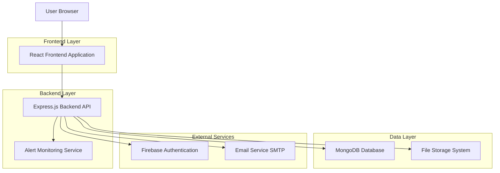
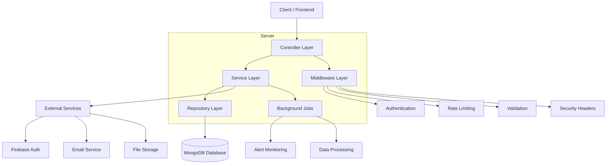
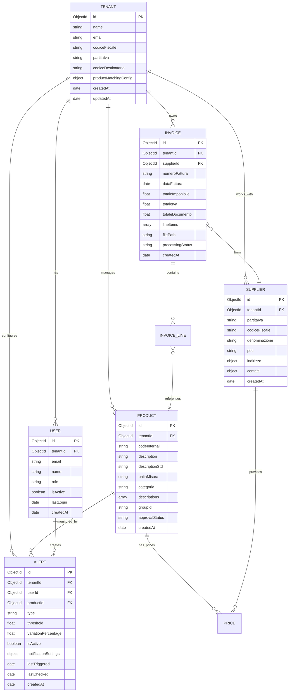

# InMyHands - Architettura Tecnica

## 1. Architettura Design



## 2. Technology Description

**Frontend:**

* React\@19.1.0 + React Router DOM\@7.5.1 + Material-UI\@7.0.2

* Redux Toolkit\@2.7.0 + Chart.js\@4.5.0 + Axios\@1.9.0

* React-Dropzone\@14.3.8 + i18next\@25.0.2

**Backend:**

* Node.js + Express\@4.21.2 + Mongoose\@8.14.1

* Firebase Admin SDK\@13.3.0 + Winston\@3.17.0

* Multer\@2.0.0 + XML2JS\@0.6.2 + PDF.js\@5.3.93

* Nodemailer\@7.0.2 + Node-cron\@4.0.5 + Fuzzysort\@3.1.0

**Database:**

* MongoDB (database principale)

* Firebase Authentication (gestione utenti)

* File System locale (storage fatture)

## 3. Route Definitions

| Route                  | Purpose                                                 |
| ---------------------- | ------------------------------------------------------- |
| `/dashboard`           | Dashboard principale con KPI e overview generale        |
| `/login`               | Pagina di autenticazione utente                         |
| `/register`            | Registrazione nuovo tenant                              |
| `/products`            | Lista prodotti con ricerca, filtri e analytics          |
| `/products/:id`        | Dettaglio prodotto con storico prezzi e alert           |
| `/suppliers`           | Lista fornitori con analisi spesa e potere contrattuale |
| `/suppliers/:id`       | Dettaglio fornitore con volumi, prodotti e trend        |
| `/invoices`            | Lista fatture con filtri avanzati e ricerca             |
| `/invoices/upload`     | Upload singolo e multiplo fatture con tracking          |
| `/alerts`              | Gestione completa alert prezzi e notifiche              |
| `/settings`            | Configurazioni tenant, profilo utente e preferenze      |
| `/users`               | Gestione utenti, inviti e permessi (admin only)         |
| `/products/duplicates` | Review e gestione duplicati prodotti                    |
| `/profile`             | Profilo utente personale                                |

## 4. API Definitions

### 4.1 Core API

**Authentication APIs**

```
POST /api/auth/login
```

Request:

| Param Name | Param Type | isRequired | Description     |
| ---------- | ---------- | ---------- | --------------- |
| email      | string     | true       | Email utente    |
| password   | string     | true       | Password utente |

Response:

| Param Name | Param Type | Description                  |
| ---------- | ---------- | ---------------------------- |
| token      | string     | JWT token per autenticazione |
| user       | object     | Dati utente                  |
| tenant     | object     | Dati tenant                  |

**Invoice Processing APIs**

```
POST /api/invoices/upload
```

Request:

| Param Name | Param Type | isRequired | Description          |
| ---------- | ---------- | ---------- | -------------------- |
| file       | file       | true       | File fattura XML/PDF |
| tenantId   | string     | true       | ID tenant            |

Response:

| Param Name       | Param Type | Description           |
| ---------------- | ---------- | --------------------- |
| invoiceId        | string     | ID fattura creata     |
| processingStatus | string     | Stato elaborazione    |
| matchedProducts  | number     | Prodotti matchati     |
| newProducts      | number     | Nuovi prodotti creati |

**Product Matching APIs**

```
GET /api/product-matching/reviews/pending
```

Response:

| Param Name | Param Type | Description           |
| ---------- | ---------- | --------------------- |
| reviews    | array      | Lista review pendenti |
| totalCount | number     | Totale review         |
| pagination | object     | Info paginazione      |

**Alert Management APIs**

```
POST /api/alerts
```

Request:

| Param Name           | Param Type | isRequired | Description                                    |
| -------------------- | ---------- | ---------- | ---------------------------------------------- |
| productId            | string     | true       | ID prodotto da monitorare                      |
| type                 | string     | true       | Tipo alert (price\_threshold/price\_variation) |
| threshold            | number     | true       | Soglia prezzo                                  |
| notificationSettings | object     | true       | Configurazione notifiche                       |

Response:

| Param Name | Param Type | Description        |
| ---------- | ---------- | ------------------ |
| alertId    | string     | ID alert creato    |
| status     | string     | Stato alert        |
| nextCheck  | date       | Prossimo controllo |

## 5. Server Architecture Diagram



## 6. Data Model

### 6.1 Data Model Definition



### 6.2 Data Definition Language

**Tenant Collection**

```javascript
// Create collection
const tenantSchema = new mongoose.Schema({
  name: { type: String, required: true },
  email: { type: String, required: true, unique: true },
  codiceFiscale: { type: String },
  partitaIva: { type: String },
  codiceDestinatario: { type: String, required: true },
  productMatchingConfig: {
    phase1: {
      enabled: { type: Boolean, default: true },
      confidenceThreshold: { type: Number, default: 0.7 },
      autoApproveAbove: { type: Number, default: 0.9 },
      requireManualReview: { type: Boolean, default: false }
    },
    phase2: {
      enabled: { type: Boolean, default: true },
      handleUnmatched: { type: Boolean, default: true },
      createNewProducts: { type: Boolean, default: true },
      requireApprovalForNew: { type: Boolean, default: false }
    },
    phase3: {
      enabled: { type: Boolean, default: false },
      analyticsLevel: { type: String, default: 'basic' },
      mlOptimization: { type: Boolean, default: false }
    }
  }
}, { timestamps: true });

// Create indexes
tenantSchema.index({ email: 1 });
tenantSchema.index({ codiceDestinatario: 1 });
```

**Invoice Collection**

```javascript
// Create collection
const invoiceSchema = new mongoose.Schema({
  tenantId: { type: mongoose.Schema.Types.ObjectId, ref: 'Tenant', required: true },
  supplierId: { type: mongoose.Schema.Types.ObjectId, ref: 'Supplier' },
  numeroFattura: { type: String, required: true },
  dataFattura: { type: Date, required: true },
  totaleImponibile: { type: Number, required: true },
  totaleIva: { type: Number, required: true },
  totaleDocumento: { type: Number, required: true },
  lineItems: [{
    productId: { type: mongoose.Schema.Types.ObjectId, ref: 'Product' },
    descrizione: { type: String, required: true },
    quantita: { type: Number, required: true },
    prezzoUnitario: { type: Number, required: true },
    totaleRiga: { type: Number, required: true },
    productMatchingStatus: { type: String, enum: ['matched', 'pending', 'unmatched'], default: 'pending' },
    matchConfidence: { type: Number, min: 0, max: 1 },
    matchedProductId: { type: mongoose.Schema.Types.ObjectId, ref: 'Product' },
    reviewedBy: { type: mongoose.Schema.Types.ObjectId, ref: 'User' },
    reviewedAt: { type: Date }
  }],
  filePath: { type: String, required: true },
  processingStatus: { type: String, enum: ['pending', 'processing', 'completed', 'error'], default: 'pending' }
}, { timestamps: true });

// Create indexes
invoiceSchema.index({ tenantId: 1, dataFattura: -1 });
invoiceSchema.index({ tenantId: 1, supplierId: 1 });
invoiceSchema.index({ tenantId: 1, numeroFattura: 1 });
invoiceSchema.index({ 'lineItems.productId': 1 });
```

**Product Collection**

```javascript
// Create collection
const productSchema = new mongoose.Schema({
  tenantId: { type: mongoose.Schema.Types.ObjectId, ref: 'Tenant', required: true },
  codeInternal: { type: String, required: true },
  description: { type: String, required: true },
  descriptionStd: { type: String, required: true },
  unitaMisura: { type: String },
  categoria: { type: String },
  descriptions: [{
    text: { type: String, required: true },
    normalizedText: { type: String, required: true },
    source: { type: String, enum: ['invoice', 'manual', 'import'], default: 'invoice' },
    frequency: { type: Number, default: 1 },
    lastSeen: { type: Date, default: Date.now },
    confidence: { type: Number, min: 0, max: 1, default: 1 }
  }],
  groupId: { type: String }, // Per gestione duplicati
  approvalStatus: { type: String, enum: ['pending', 'approved', 'rejected'], default: 'approved' },
  approvedBy: { type: mongoose.Schema.Types.ObjectId, ref: 'User' },
  approvedAt: { type: Date }
}, { timestamps: true });

// Create indexes
productSchema.index({ tenantId: 1, codeInternal: 1 }, { unique: true });
productSchema.index({ tenantId: 1, descriptionStd: 'text' });
productSchema.index({ tenantId: 1, groupId: 1 });
productSchema.index({ tenantId: 1, approvalStatus: 1 });
```

**Alert Collection**

```javascript
// Create collection
const alertSchema = new mongoose.Schema({
  tenantId: { type: mongoose.Schema.Types.ObjectId, ref: 'Tenant', required: true },
  userId: { type: mongoose.Schema.Types.ObjectId, ref: 'User', required: true },
  productId: { type: mongoose.Schema.Types.ObjectId, ref: 'Product', required: true },
  type: { type: String, enum: ['price_threshold', 'price_variation'], required: true },
  threshold: { type: Number }, // Per price_threshold
  variationPercentage: { type: Number }, // Per price_variation
  isActive: { type: Boolean, default: true },
  notificationSettings: {
    email: { type: Boolean, default: true },
    pec: { type: Boolean, default: false },
    inApp: { type: Boolean, default: true }
  },
  lastTriggered: { type: Date },
  lastChecked: { type: Date },
  triggerCount: { type: Number, default: 0 }
}, { timestamps: true });

// Create indexes
alertSchema.index({ tenantId: 1, userId: 1 });
alertSchema.index({ tenantId: 1, productId: 1 });
alertSchema.index({ isActive: 1, lastChecked: 1 });
alertSchema.index({ tenantId: 1, type: 1 });
```

**Supplier Collection**

```javascript
// Create collection
const supplierSchema = new mongoose.Schema({
  tenantId: { type: mongoose.Schema.Types.ObjectId, ref: 'Tenant', required: true },
  partitaIva: { type: String, required: true },
  codiceFiscale: { type: String },
  denominazione: { type: String, required: true },
  pec: { type: String },
  indirizzo: {
    via: String,
    civico: String,
    cap: String,
    comune: String,
    provincia: String,
    nazione: { type: String, default: 'IT' }
  },
  contatti: {
    telefono: String,
    email: String,
    sito: String
  },
  note: String
}, { timestamps: true });

// Create indexes
supplierSchema.index({ tenantId: 1, partitaIva: 1 }, { unique: true });
supplierSchema.index({ tenantId: 1, denominazione: 1 });
```

**Initial Data Setup**

```javascript
// Default tenant configuration
const defaultTenantConfig = {
  productMatchingConfig: {
    phase1: {
      enabled: true,
      confidenceThreshold: 0.7,
      autoApproveAbove: 0.9,
      requireManualReview: false
    },
    phase2: {
      enabled: true,
      handleUnmatched: true,
      createNewProducts: true,
      requireApprovalForNew: false
    },
    phase3: {
      enabled: false,
      analyticsLevel: 'basic',
      mlOptimization: false
    },
    globalSettings: {
      maxPendingReviews: 100,
      notificationThresholds: {
        pendingReviews: 50,
        lowConfidenceMatches: 20,
        unmatchedProducts: 30
      },
      autoCleanupDays: 30
    }
  }
};
```

