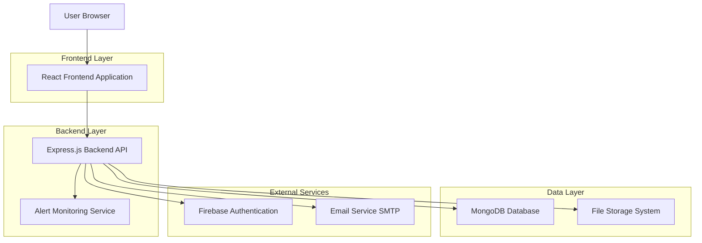
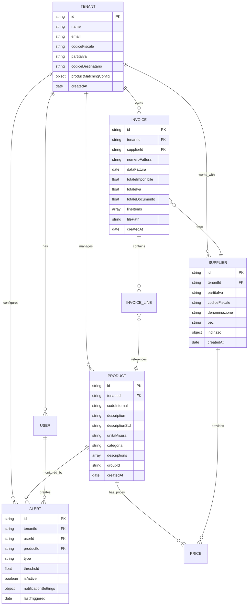
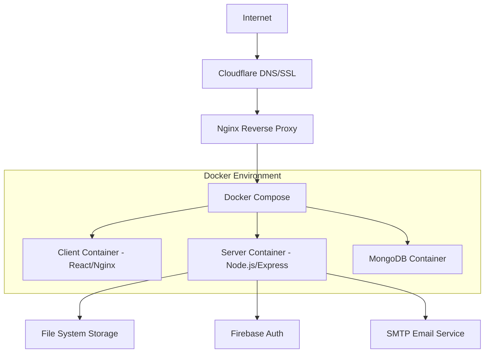

# InMyHands - Documentazione Tecnica Completa

## 1. Panoramica dell'Applicazione

**InMyHands** è una piattaforma SaaS multi-tenant per la gestione e analisi degli acquisti aziendali attraverso l'elaborazione automatica delle fatture elettroniche. L'applicazione permette alle aziende di:

- **Automatizzare l'importazione** delle fatture XML/PDF
- **Analizzare i costi** e identificare opportunità di risparmio
- **Monitorare i fornitori** e valutare il potere contrattuale
- **Gestire i prodotti** con sistema di matching intelligente
- **Impostare alert** sui prezzi per controllo automatico
- **Generare insights** per decisioni di acquisto strategiche

### Obiettivi di Business
- Ridurre i costi di approvvigionamento attraverso analisi data-driven
- Automatizzare processi manuali di gestione fatture
- Fornire visibilità completa sulla spesa aziendale
- Identificare opportunità di negoziazione con fornitori
- Prevenire aumenti di prezzo non autorizzati

## 2. Architettura Tecnica

### 2.1 Architettura Generale



### 2.2 Stack Tecnologico

**Frontend:**
- React 19.1.0 + React Router DOM 7.5.1
- Material-UI 7.0.2 (componenti UI)
- Redux Toolkit 2.7.0 (state management)
- Chart.js 4.5.0 + React-ChartJS-2 (grafici)
- React-Dropzone 14.3.8 (upload file)
- i18next 25.0.2 (internazionalizzazione)
- Axios 1.9.0 (HTTP client)

**Backend:**
- Node.js + Express.js 4.21.2
- MongoDB + Mongoose 8.14.1
- Firebase Admin SDK 13.3.0
- Multer 2.0.0 (file upload)
- XML2JS 0.6.2 (parsing XML)
- PDF.js 5.3.93 (parsing PDF)
- Nodemailer 7.0.2 (email)
- Node-cron 4.0.5 (scheduled tasks)
- Winston 3.17.0 (logging)
- Fuzzysort 3.1.0 (fuzzy matching)

**Database:**
- MongoDB (database principale)
- Firebase Authentication (gestione utenti)
- File System locale (storage fatture)

### 2.3 Definizione Route Frontend

| Route | Scopo |
|-------|-------|
| `/dashboard` | Dashboard principale con KPI e overview |
| `/login` | Pagina di autenticazione |
| `/register` | Registrazione nuovo tenant |
| `/products` | Lista prodotti con ricerca e filtri |
| `/products/:id` | Dettaglio prodotto con storico e alert |
| `/suppliers` | Lista fornitori con analisi spesa |
| `/suppliers/:id` | Dettaglio fornitore con volumi e prodotti |
| `/invoices` | Lista fatture con filtri e ricerca |
| `/invoices/upload` | Upload singolo e multiplo fatture |
| `/alerts` | Gestione alert prezzi |
| `/settings` | Configurazioni tenant e profilo utente |
| `/users` | Gestione utenti e inviti (admin) |

### 2.4 API Endpoints Principali

**Autenticazione:**
```
POST /api/auth/login
POST /api/auth/register
POST /api/auth/logout
POST /api/auth/reset-password
```

**Fatture:**
```
POST /api/invoices/upload
POST /api/invoices/upload-multiple
GET  /api/invoices
GET  /api/invoices/:id
GET  /api/invoices/stats
```

**Prodotti:**
```
GET  /api/products
GET  /api/products/:id
PUT  /api/products/:id
GET  /api/products/duplicates
POST /api/products/merge-duplicates
```

**Fornitori:**
```
GET  /api/suppliers
GET  /api/suppliers/:id
GET  /api/suppliers/:id/products
GET  /api/suppliers/:id/stats
```

**Alert:**
```
GET  /api/alerts
POST /api/alerts
PUT  /api/alerts/:id
DELETE /api/alerts/:id
POST /api/alerts/:id/toggle
```

## 3. Modello Dati

### 3.1 Schema Database



### 3.2 Definizioni DDL Principali

**Tenant Collection:**
```javascript
const tenantSchema = new mongoose.Schema({
  name: { type: String, required: true },
  email: { type: String, required: true, unique: true },
  codiceFiscale: String,
  partitaIva: String,
  codiceDestinatario: { type: String, required: true },
  productMatchingConfig: {
    phase1: {
      enabled: { type: Boolean, default: true },
      confidenceThreshold: { type: Number, default: 0.7 },
      autoApproveAbove: { type: Number, default: 0.9 }
    },
    phase2: {
      enabled: { type: Boolean, default: true },
      requireApprovalForNew: { type: Boolean, default: false }
    }
  }
});
```

**Invoice Collection:**
```javascript
const invoiceSchema = new mongoose.Schema({
  tenantId: { type: mongoose.Schema.Types.ObjectId, ref: 'Tenant', required: true },
  supplierId: { type: mongoose.Schema.Types.ObjectId, ref: 'Supplier' },
  numeroFattura: String,
  dataFattura: Date,
  totaleImponibile: Number,
  totaleIva: Number,
  totaleDocumento: Number,
  lineItems: [{
    productId: { type: mongoose.Schema.Types.ObjectId, ref: 'Product' },
    descrizione: String,
    quantita: Number,
    prezzoUnitario: Number,
    totaleRiga: Number,
    productMatchingStatus: String,
    matchConfidence: Number
  }],
  filePath: String
});
```

## 4. Funzionalità Implementate

### 4.1 Sistema di Upload e Parsing Fatture ✅

**Caratteristiche:**
- Upload singolo e multiplo con drag & drop
- Supporto formati XML (FatturaPA) e PDF
- Parsing automatico metadati e righe dettaglio
- Validazione codice destinatario
- Tracking asincrono per upload multipli

**Flusso di elaborazione:**
1. Upload file → Validazione formato
2. Parsing XML/PDF → Estrazione dati
3. Lookup/Creazione fornitore
4. Matching prodotti con sistema intelligente
5. Salvataggio fattura e aggiornamento prezzi

### 4.2 Sistema di Matching Prodotti ✅

**Architettura a 3 fasi:**

**Phase 1 - Enhanced Product Matching:**
- Fuzzy matching con confidence scoring
- Soglie configurabili per auto-approvazione
- Gestione descrizioni alternative
- Review manuale per match a bassa confidenza

**Phase 2 - New Product Creation Control:**
- Controllo creazione automatica nuovi prodotti
- Workflow di approvazione configurabile
- Capacità di bulk approval

**Phase 3 - ML-Based Matching (Futuro):**
- Machine learning per matching avanzato
- Apprendimento da decisioni manuali
- Miglioramento continuo del modello

**Algoritmi di Matching:**
- **Exact Match** (0.95+): Descrizioni normalizzate identiche
- **High Fuzzy** (0.8-0.94): Descrizioni molto simili
- **Medium Fuzzy** (0.6-0.79): Moderatamente simili
- **Low Fuzzy** (0.4-0.59): Parzialmente simili

### 4.3 Gestione Duplicati Prodotti ✅

**Funzionalità:**
- Rilevamento automatico duplicati via groupID
- Interfaccia di review per unire/ignorare duplicati
- Algoritmi multi-livello per identificazione
- Statistiche e insights sui duplicati

### 4.4 Dashboard e Analytics ✅

**Sezioni implementate:**

**Dashboard Principale:**
- KPI cards: spesa mensile, numero fatture, fornitori attivi
- Grafici trend spesa e volumi
- Top prodotti e fornitori per spesa
- Statistiche comparative

**Sezione Prodotti:**
- Overview generale acquisti
- Lista prodotti con ricerca e filtri
- Dettaglio prodotto con storico prezzi
- Volumi mensili e trend

**Sezione Fornitori:**
- Analisi potere contrattuale
- Volumi di spesa per fornitore
- Dettaglio fornitore con prodotti
- Trend mensili e statistiche

**Sezione Fatture:**
- Lista completa con filtri avanzati
- Dettaglio fattura con righe
- Ricerca per numero, fornitore, periodo

### 4.5 Sistema Alert Prezzi 🚧

**Backend completamente implementato ✅:**
- Modello Alert con tipi price_threshold e price_variation
- Controller CRUD completo
- Servizio di monitoraggio automatico (cron job)
- Invio notifiche email/PEC
- API complete per gestione alert

**Frontend parzialmente implementato 🚧:**
- UI presente in ProductDetail per alert soglia
- Pagina Alerts principale da completare
- Integrazione backend da finalizzare
- Manca supporto alert variazione prezzo

**Stato completamento: ~40%**

### 4.6 Gestione Utenti e Tenant ✅

**Funzionalità:**
- Registrazione tenant con token temporaneo
- Sistema di inviti utenti
- Gestione ruoli e permessi
- Profilo utente e configurazioni
- Multi-tenancy completa

## 5. Configurazione Deployment

### 5.1 Architettura Deployment



### 5.2 Configurazione Docker

**docker-compose.test.yml:**
```yaml
version: '3.8'
services:
  nginx:
    image: nginx:alpine
    ports:
      - "80:80"
      - "443:443"
    volumes:
      - ./nginx/test.conf:/etc/nginx/nginx.conf
      - ./nginx/ssl:/etc/nginx/ssl
    depends_on:
      - client
      - server

  client:
    build:
      context: ./client
      dockerfile: Dockerfile.test
    expose:
      - "80"

  server:
    build:
      context: ./server
      dockerfile: Dockerfile.test
    expose:
      - "4000"
    environment:
      - NODE_ENV=production
    volumes:
      - ./Data:/app/Data
```

### 5.3 Script di Deploy Automatizzato

**deploy-test.sh:**
```bash
#!/bin/bash
echo "Stopping existing containers..."
docker-compose -f docker-compose.test.yml down

echo "Pulling latest changes..."
git pull origin main

echo "Building client..."
cd client
cp ../.env.test .env
yarn install
yarn build
rm .env
cd ..

echo "Building and starting containers..."
docker-compose -f docker-compose.test.yml up -d --build
```

### 5.4 Sicurezza

**Misure implementate:**
- HTTPS obbligatorio con certificati SSL
- Rate limiting su API
- Sanitizzazione input
- Headers di sicurezza (Helmet.js)
- Autenticazione Firebase
- CORS configurato
- Logging completo con Winston
- Gestione errori centralizzata

## 6. Roadmap e Funzionalità Future

### 6.1 Priorità Alta 🔴

**Completamento Sistema Alert:**
- Finalizzare integrazione frontend alert
- Implementare dashboard alert principale
- Aggiungere alert variazione prezzo
- Test completi sistema notifiche

**Calcolo Risparmio (ProductDetail):**
- Input: prodotto, quantità, nuovo prezzo
- Calcolo risparmio su volumi ultimi 12 mesi
- Confronto con prezzi storici
- Proiezioni annuali

### 6.2 Priorità Media 🟡

**Export e Reporting:**
- Export PDF/Excel per tutte le sezioni
- Report personalizzati
- Scheduling report automatici
- Dashboard executive summary

**Miglioramenti UX:**
- Filtri avanzati su tutte le liste
- Ricerca globale cross-section
- Notifiche in-app
- Mobile responsiveness

**Ottimizzazioni Performance:**
- Caching Redis
- Paginazione server-side
- Lazy loading componenti
- Ottimizzazione query database

### 6.3 Priorità Bassa 🟢

**Machine Learning (Phase 3):**
- Neural network per product matching
- Predizioni trend prezzi
- Raccomandazioni fornitori
- Anomaly detection

**Integrazioni Esterne:**
- API fornitori per cataloghi
- Integrazione ERP
- Connettori e-commerce
- API marketplace

**Advanced Analytics:**
- Benchmarking settoriale
- Analisi predittive
- Seasonal analysis
- Supplier risk assessment

## 7. Guide per Sviluppatori

### 7.1 Setup Ambiente di Sviluppo

**Prerequisiti:**
```bash
# Node.js 18+
node --version

# MongoDB locale o cloud
mongodb://localhost:27017

# Firebase project configurato
# File .env con variabili necessarie
```

**Installazione:**
```bash
# Clone repository
git clone <repository-url>
cd in-my-hands

# Install dependencies
cd client && npm install
cd ../server && npm install

# Setup environment variables
cp .env.example .env
# Configurare variabili in .env

# Start development
# Terminal 1 - Backend
cd server && npm run dev

# Terminal 2 - Frontend  
cd client && npm start
```

### 7.2 Struttura Progetto

```
in-my-hands/
├── client/                 # React frontend
│   ├── src/
│   │   ├── components/     # Componenti riutilizzabili
│   │   ├── pages/         # Pagine principali
│   │   ├── store/         # Redux store
│   │   ├── hooks/         # Custom hooks
│   │   └── utils/         # Utility functions
│   └── public/
├── server/                # Express backend
│   ├── src/
│   │   ├── controllers/   # Route handlers
│   │   ├── models/        # Mongoose models
│   │   ├── services/      # Business logic
│   │   ├── middleware/    # Express middleware
│   │   ├── routes/        # API routes
│   │   └── utils/         # Utility functions
│   └── scripts/           # Maintenance scripts
├── nginx/                 # Nginx configuration
├── Documentazione/        # Project documentation
└── Data/                  # File storage
```

### 7.3 Convenzioni di Codice

**Naming Conventions:**
- Componenti React: PascalCase (es. `ProductDetail.jsx`)
- File service: camelCase + Service (es. `productMatchingService.js`)
- API routes: kebab-case (es. `/api/product-matching`)
- Database collections: camelCase (es. `productDuplicates`)

**Struttura Componenti React:**
```javascript
// Imports
import React, { useState, useEffect } from 'react';
import { useSelector, useDispatch } from 'react-redux';

// Component
const ComponentName = ({ prop1, prop2 }) => {
  // Hooks
  const [state, setState] = useState();
  const data = useSelector(state => state.data);
  
  // Effects
  useEffect(() => {
    // Effect logic
  }, []);
  
  // Handlers
  const handleAction = () => {
    // Handler logic
  };
  
  // Render
  return (
    <div>
      {/* JSX */}
    </div>
  );
};

export default ComponentName;
```

**Struttura Service Backend:**
```javascript
// Imports
import Model from '../models/Model.js';
import logger from '../utils/logger.js';

// Service class
class ServiceName {
  async methodName(params) {
    try {
      // Business logic
      logger.info('Operation completed', { params });
      return result;
    } catch (error) {
      logger.error('Operation failed', { error, params });
      throw error;
    }
  }
}

export default new ServiceName();
```

### 7.4 Testing

**Frontend Testing:**
```bash
# Run tests
cd client && npm test

# Coverage report
npm test -- --coverage
```

**Backend Testing:**
```bash
# Unit tests
cd server && npm test

# Integration tests
npm run test:integration
```

### 7.5 Debugging

**Logging:**
- Frontend: Console + Redux DevTools
- Backend: Winston logger con livelli
- Database: MongoDB Compass per query

**Common Issues:**
- CORS errors: Verificare configurazione allowedOrigins
- Authentication: Controllare token Firebase
- File upload: Verificare permessi directory Data/
- Performance: Monitorare query MongoDB lente

### 7.6 Deployment

**Ambiente Test:**
```bash
# Deploy su server test
./deploy-test.sh

# Verifica deployment
curl https://dev.inmyhands.it/api/health
```

**Ambiente Produzione:**
```bash
# Build production
npm run build:production

# Deploy con zero-downtime
./deploy-production.sh
```

---

## Conclusioni

InMyHands rappresenta una soluzione completa per la gestione intelligente degli acquisti aziendali. L'architettura modulare e scalabile permette un'evoluzione continua delle funzionalità, mentre il sistema di matching prodotti e gli alert automatici forniscono valore immediato agli utenti business.

Le prossime priorità di sviluppo si concentrano sul completamento del sistema alert e sull'implementazione delle funzionalità di calcolo risparmio, che completeranno il core value proposition della piattaforma.

La documentazione tecnica fornisce una base solida per il team di sviluppo per continuare l'evoluzione del prodotto in modo efficiente e mantenibile.