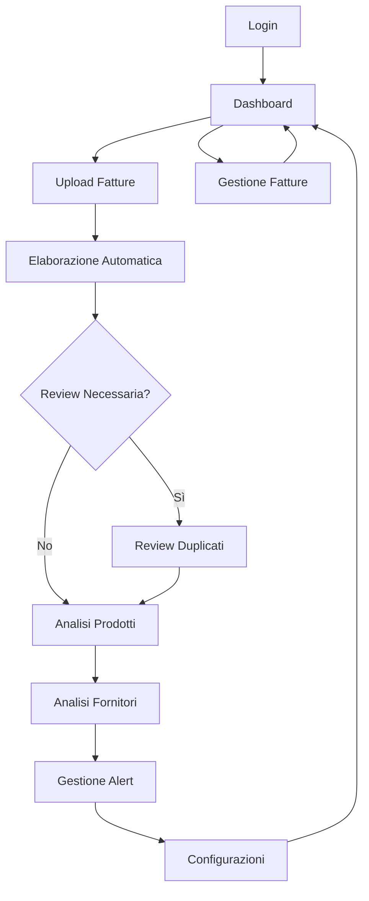

# InMyHands - Product Requirements Document

## 1. Product Overview

InMyHands è una piattaforma SaaS multi-tenant per l'analisi intelligente degli acquisti aziendali attraverso l'elaborazione automatica delle fatture elettroniche. La soluzione permette alle aziende di automatizzare la gestione delle fatture, analizzare i costi, monitorare i fornitori e ottimizzare le strategie di approvvigionamento.

L'applicazione risolve il problema della gestione manuale delle fatture e della mancanza di visibilità sui costi aziendali, fornendo insights data-driven per decisioni di acquisto strategiche. Il target sono PMI e aziende che necessitano di controllo e ottimizzazione dei costi di approvvigionamento.

## 2. Core Features

### 2.1 User Roles

| Role          | Registration Method               | Core Permissions                                 |
| ------------- | --------------------------------- | ------------------------------------------------ |
| Tenant Admin  | Email registration + tenant setup | Gestione completa tenant, utenti, configurazioni |
| Standard User | Invito da admin                   | Accesso dashboard, prodotti, fornitori, fatture  |
| Reviewer      | Assegnazione da admin             | Review prodotti duplicati e matching             |

### 2.2 Feature Module

La piattaforma InMyHands è composta dalle seguenti pagine principali:

1. **Dashboard**: KPI aziendali, grafici trend spesa, top prodotti e fornitori
2. **Upload Fatture**: interfaccia drag-and-drop per upload singolo e multiplo con tracking
3. **Gestione Prodotti**: lista prodotti, ricerca avanzata, dettaglio con storico prezzi e alert
4. **Gestione Fornitori**: analisi fornitori, potere contrattuale, dettaglio con volumi e trend
5. **Gestione Fatture**: lista completa fatture con filtri, ricerca e dettaglio righe
6. **Sistema Alert**: configurazione e gestione alert prezzi con notifiche automatiche
7. **Review Duplicati**: interfaccia per gestione duplicati prodotti e matching manuale
8. **Configurazioni**: gestione tenant, utenti, profilo e impostazioni sistema

### 2.3 Page Details

| Page Name           | Module Name         | Feature Description                                                                |
| ------------------- | ------------------- | ---------------------------------------------------------------------------------- |
| Dashboard           | KPI Cards           | Visualizza spesa mensile, numero fatture, fornitori attivi, variazioni percentuali |
| Dashboard           | Trend Charts        | Grafici mensili spesa e volumi con Chart.js, filtri per periodo                    |
| Dashboard           | Top Lists           | Top 5 prodotti e fornitori per spesa, link navigazione dettagli                    |
| Upload Fatture      | Drag & Drop         | Upload multiplo file XML/PDF, validazione formato, progress tracking               |
| Upload Fatture      | Processing Status   | Monitoraggio elaborazione asincrona, notifiche completamento                       |
| Gestione Prodotti   | Product List        | Lista paginata con ricerca full-text, filtri categoria/fornitore                   |
| Gestione Prodotti   | Product Analytics   | Volumi acquisto, trend prezzi, spesa totale per prodotto                           |
| Dettaglio Prodotto  | Overview            | KPI prodotto: volumi mensili, prezzo medio vs ultimo, spesa totale                 |
| Dettaglio Prodotto  | Purchase History    | Storico acquisti cronologico con quantità, prezzo, fornitore                       |
| Dettaglio Prodotto  | Price Alerts        | Configurazione alert soglia prezzo e variazione percentuale                        |
| Dettaglio Prodotto  | Savings Calculator  | Calcolo risparmio su nuove proposte prezzo basato su volumi storici                |
| Gestione Fornitori  | Supplier List       | Lista fornitori con % spesa, volumi, analisi potere contrattuale                   |
| Gestione Fornitori  | Supplier Analytics  | Grafici spesa per fornitore, trend mensili, confronti                              |
| Dettaglio Fornitore | Volume Analysis     | Volumi mensili spesa, grafici trend, prodotti più acquistati                       |
| Dettaglio Fornitore | Product Breakdown   | Lista prodotti acquistati con volumi, prezzi, link dettaglio                       |
| Gestione Fatture    | Invoice List        | Lista paginata con filtri data/fornitore/importo, ricerca numero                   |
| Gestione Fatture    | Invoice Detail      | Dettaglio fattura con header info e righe prodotti                                 |
| Sistema Alert       | Alert Dashboard     | Lista alert attivi, statistiche trigger, configurazione globale                    |
| Sistema Alert       | Alert Configuration | Creazione/modifica alert con soglie, notifiche email/PEC                           |
| Review Duplicati    | Duplicate Detection | Lista gruppi duplicati con confidence score, azioni merge/ignore                   |
| Review Duplicati    | Manual Matching     | Interfaccia review matching prodotti con suggerimenti                              |
| Configurazioni      | Tenant Settings     | Configurazione dati azienda, codice destinatario, matching config                  |
| Configurazioni      | User Management     | Gestione utenti, inviti, ruoli e permessi                                          |

## 3. Core Process

### Flusso Principale Utente

1. **Login e Dashboard**: L'utente accede alla piattaforma e visualizza la dashboard con KPI e trend
2. **Upload Fatture**: Carica fatture XML/PDF tramite drag-and-drop o selezione multipla
3. **Elaborazione Automatica**: Il sistema processa le fatture, estrae dati, matcha prodotti e aggiorna prezzi
4. **Review e Validazione**: Se necessario, l'utente rivede matching prodotti e duplicati
5. **Analisi e Insights**: Naviga tra prodotti, fornitori e fatture per analisi approfondite
6. **Configurazione Alert**: Imposta alert prezzi per monitoraggio automatico
7. **Gestione Configurazioni**: Amministra utenti, impostazioni e configurazioni sistema

### Flusso Admin

1. **Setup Tenant**: Configurazione iniziale dati azienda e codice destinatario
2. **Gestione Utenti**: Invito utenti, assegnazione ruoli e permessi
3. **Configurazione Matching**: Setup parametri matching prodotti e soglie approvazione
4. **Monitoraggio Sistema**: Controllo performance, review duplicati, gestione alert

## 4. User Interface Design

### 4.1 Design Style

**Colori Primari:**

* Primary: #3F51B5 (Indigo)

* Secondary: #E91E63 (Pink)

* Success: #4CAF50 (Green)

* Warning: #FF9800 (Orange)

* Error: #F44336 (Red)

**Stile Componenti:**

* Bottoni: Material Design con bordi arrotondati (8px radius)

* Cards: Elevazione sottile con ombre, padding 16px

* Input: Outlined style con focus blu

**Typography:**

* Font Family: "Inter", sans-serif

* Heading: 24px/32px/20px per H1/H2/H3

* Body: 16px regular, 14px small

* Caption: 12px per metadati

**Layout:**

* Sidebar navigation con icone Material

* Card-based layout per contenuti

* Grid responsive 12 colonne

* Spacing: 8px base unit (8, 16, 24, 32px)

**Icons & Animations:**

* Material Icons per consistenza

* Micro-animazioni per feedback (hover, click)

* Loading spinners per operazioni async

* Smooth transitions (300ms ease-in-out)

### 4.2 Page Design Overview

| Page Name         | Module Name | UI Elements                                                                 |
| ----------------- | ----------- | --------------------------------------------------------------------------- |
| Dashboard         | KPI Cards   | Cards con icone colorate, numeri grandi, variazioni percentuali verdi/rosse |
| Dashboard         | Charts      | Line charts per trend, bar charts per confronti, colori brand               |
| Upload Fatture    | Drag Zone   | Area tratteggiata con icona upload, feedback visivo drag-over               |
| Upload Fatture    | File List   | Lista file con progress bar, icone tipo file, azioni rimuovi                |
| Product List      | Data Table  | Tabella sortabile con avatar prodotto, chip categoria, azioni quick         |
| Product List      | Filters     | Sidebar filtri con autocomplete, date picker, multi-select                  |
| Product Detail    | Tabs        | Tab navigation per Overview/History/Alerts/Calculator                       |
| Product Detail    | Charts      | Area charts per volumi, line charts per prezzi nel tempo                    |
| Supplier List     | Cards Grid  | Cards fornitori con avatar, KPI principali, rating visivo                   |
| Alert Config      | Form        | Stepper form per configurazione, toggle switches, slider soglie             |
| Review Duplicates | Split View  | Lista sinistra duplicati, dettaglio destro con azioni merge                 |

### 4.3 Responsiveness

L'applicazione è **desktop-first** con adattamento mobile:

* **Desktop (1200px+)**: Layout completo con sidebar, tabelle full-width

* **Tablet (768-1199px)**: Sidebar collassabile, tabelle scrollabili orizzontalmente

* **Mobile (320-767px)**: Navigation drawer, cards stack verticalmente, tabelle responsive

**Touch Optimization:**

* Bottoni min 44px per touch target

* Swipe gestures per navigation mobile

* Pull-to-refresh su liste

* Touch-friendly dropdowns e selectors

**Performance Mobile:**

* Lazy loading immagini e componenti

* Infinite scroll per liste lung

